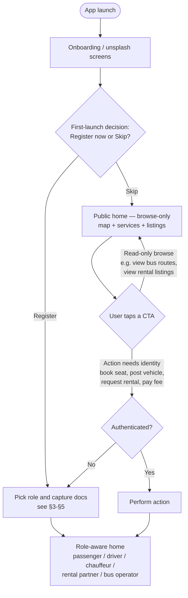
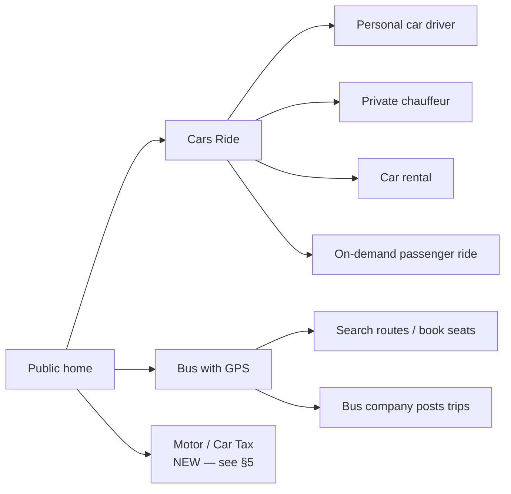
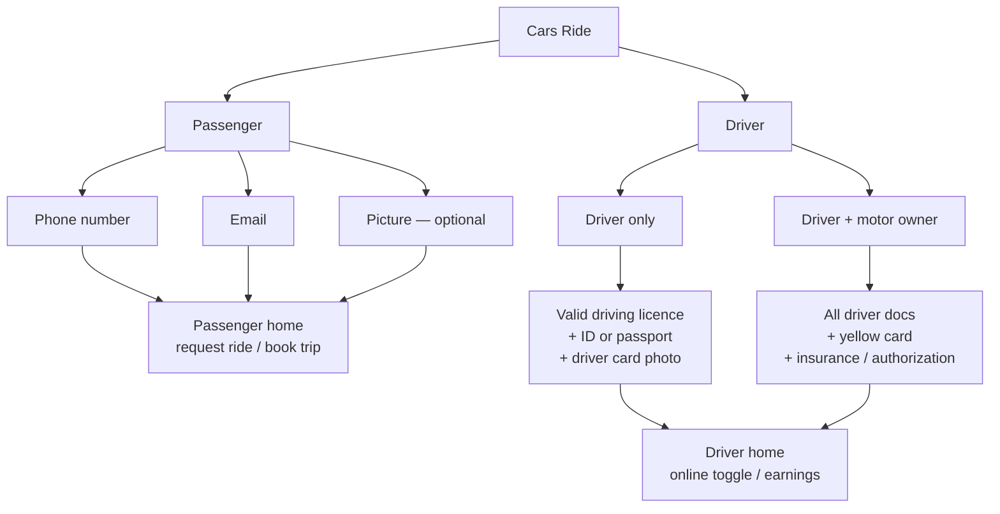
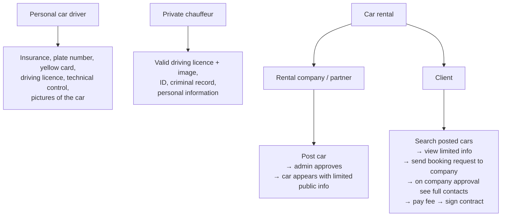
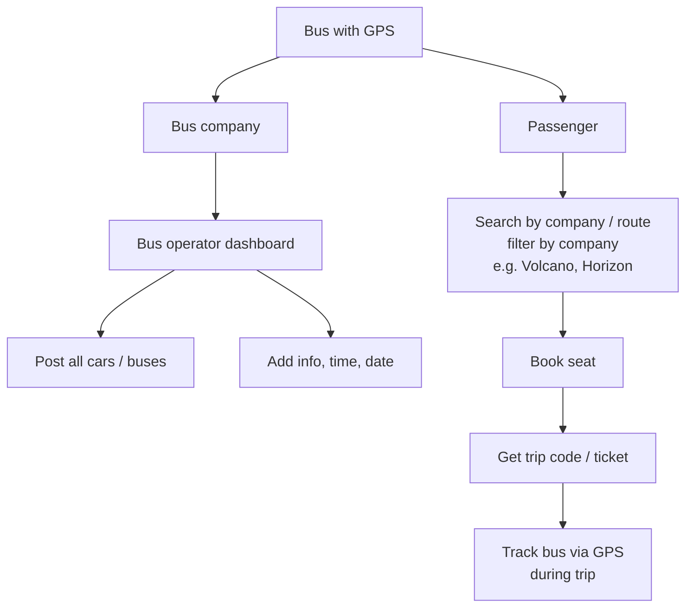
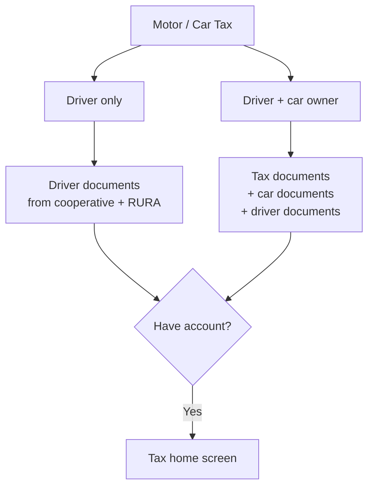

# YourDrive — Client's Intended User Flow (cleaned-up reading)

**Date:** 2026-05-08
**Source:** Hand-drawn flow diagram sent by client (2026-05-08)
**Companion docs:**
- `2026-04-16-feature-gap-analysis.md` (see new §8 for alignment work)
- `2026-04-16-consolidated-requirements.md`

**Why this doc exists:** the client's diagram packs a lot of intent into a noisy single page. This doc re-renders the same intent as a layered Mermaid flow plus per-role document tables, so we have a clean reference to align engineering against. Where the original diagram was ambiguous or contradictory, we've made an interpretation and called it out under **Interpretation notes**.

---

## 1. Top-level entry flow (auth is NOT a gate)

The client's headline rule: **using the app is not gated by auth**. A user can browse and explore freely. They are only required to sign up at the moment they attempt an action that needs an identity (book a seat, post a vehicle, become a driver, pay a fee, etc.).

**Interpretation notes**

- The client wrote both *"do you want to register now or skip"* (top-left of source) and *"if you are not registered you have to register faster on the platform"* (bottom-right). These read as contradictory but are not — they describe two different moments: the first-launch splash decision, and the just-in-time prompt that fires when a guest hits a gated action. Diagram above shows both.
- *"Every person after register he/she will be redirected to their specific home screen which shows them the informations based about their account access"* (top-right of source) means **role-aware home screens**. Today we have one home screen for all roles; CTA visibility flexes by role. Either is acceptable — see §6 alignment work.

---

## 2. Service catalogue (browse-mode)

The client's three top-level services, all visible in browse-mode:

Per the source, *"car rental"*, *"private driver chauffeur"*, and *"personal car driver"* are all drawn as children of *"cars ride"*. In our codebase these are separate domains (`ChauffeurService`, `CarRental`, `Ride` + `RideRequest`); we keep them separate but expose them as siblings under a single "Cars" entry point in the UI to match the client's grouping.

---

## 3. Cars Ride — passenger and driver flows

**Interpretation notes**

- "Driver only" = a person who drives a motorcycle/car owned by someone else (e.g. a cooperative or a private owner who employs them). They submit personal docs only.
- "Driver + motor owner" = same person owns the vehicle. They submit personal docs **and** vehicle docs (insurance, plate / yellow card).
- Today this maps onto the existing `User` + `Vehicle` schema: a vehicle is owned by `Vehicle.userId`. We don't currently distinguish "driver-only-not-owner". To support cooperative / employer-owned vehicles cleanly we'd need a `vehicleOperatorId` separate from `vehicleOwnerId`, **or** a simpler model where a cooperative is a `User` who owns vehicles and assigns them to drivers via existing relations. Pick one.

---

## 4. Cars Ride — Personal car / Chauffeur / Rental sub-services

**Interpretation notes**

- *"Personal car driver"* in the source diagram = a driver who lists their own car for ride-hailing (overlaps heavily with our existing `Vehicle` + driver onboarding). The doc list is a useful checklist for what KYC must capture.
- *"Private chauffeur"* maps onto our existing `ChauffeurService`. **Criminal record** is the only listed doc not already in the schema — see gap-analysis §3.6 (background check status is already flagged Missing).
- *"Car rental"* describes a two-step booking funnel where (a) the client only sees teaser info until the company approves the request, and (b) full contact details only unlock after the platform fee is paid. This is **stricter than the current rental flow** — we currently surface the full `Vehicle` record on browse. See §6 alignment.

---

## 5. Bus with GPS

**Interpretation notes**

- *"Volcano / Horzon"* = pre-seeded bus operator names from the Rwandan market. These are data, not code — they'll be created via the existing `BusOperatorsTab` after slice 1 lands. Confirm exact spellings with client (Horizon? Volcano Express?).
- Slice 1 already covers: bus routes, seat booking, attendance code (acts as the trip code), passenger ticket screen, bus-driver manifest. Live GPS during the trip is **not** built — see gap-analysis §3.6 ("Live trip-share link" / "GPS trail storage").

---

## 6. Motor / Car Tax — NEW BRANCH (scope confirmation needed)

**Interpretation notes**

- This branch is **not in any existing client-request doc**, **not in `consolidated-requirements.md`**, and **not in the schema**. It appears to be a new vertical: drivers/owners use YourDrive as a digital wallet for tax compliance documents (cooperative association membership, RURA driver permits, vehicle tax receipts).
- *RURA* = Rwanda Utilities Regulatory Authority, the body that licenses commercial drivers and operators in Rwanda.
- **Recommendation:** treat this as out-of-scope for current milestones until the client confirms it. If confirmed, it's a discrete new slice — minimum required: a `DriverDocument` / `VehicleDocument` model with category enum (`COOPERATIVE_LETTER`, `RURA_PERMIT`, `TAX_RECEIPT`, etc.), upload + admin-review flow, expiry tracking. Estimated effort comparable to the KYC slice (slice 3 in the implementation tracker).

---

## 7. Per-role onboarding — required documents (consolidated)

Pulled from the source diagram and from existing onboarding code. Use this as the canonical KYC checklist when the team picks up the KYC slice (slice 3 in `implementation-status.md`).

| Role | Phone | Email | Photo | National ID / Passport | Driving licence | Driver card | Vehicle plate / yellow card | Insurance | Technical control | Vehicle photos | Criminal record | Tax / RURA / cooperative docs |
|---|---|---|---|---|---|---|---|---|---|---|---|---|
| Passenger | required | required | optional | — | — | — | — | — | — | — | — | — |
| Driver only (employed) | required | required | required | required | required | required | — | — | — | — | — | — |
| Driver + motor owner | required | required | required | required | required | required | required | required | — | — | — | — |
| Personal car driver | required | required | required | required | required | required | required | required | required | required | — | — |
| Private chauffeur | required | required | required | required | required | — | — | — | — | — | required | — |
| Rental partner | required | required | required | required | — | — | required (per car) | required (per car) | — | required (per car) | — | — |
| Bus operator | required | required | required | required | — | — | required (per bus) | required (per bus) | required (per bus) | — | — | — |
| Motor-tax user (NEW §5) | required | required | optional | required | required | — | conditional | conditional | — | — | — | required |

---

## 8. Summary of inferred client intent

1. **Auth is not a gate.** Public home + browse for everyone; per-action prompts only.
2. **One app, multiple roles, role-aware post-register routing.**
3. **Three service verticals** — Cars (with four sub-services), Bus, and Motor/Car Tax (new).
4. **KYC is per-role**, not one universal flow. The doc list grows from "phone + email" (passenger) to a multi-document set (chauffeur, rental partner, bus operator, motor-tax).
5. **Rental flow is two-step**: company approves before contact info / contract is shared with the client; platform fee gates contract signing.
6. **Bus flow needs live GPS during trip** in addition to the booking + manifest mechanics already built.
7. **Motor/Car Tax is a new, currently un-scoped vertical.** Needs client confirmation before any work.

---

## 9. Open questions for client

These are the items where our interpretation may differ from the client's intent. Worth confirming before we commit to a slice.

1. Confirm the Motor/Car Tax vertical is in scope, and which milestone it should land in.
2. Confirm "Driver only" (employed by a cooperative / vehicle owner) needs to be modelled distinctly from "Driver + motor owner" in the schema, or if "driver who happens to own no vehicle" is sufficient.
3. Confirm the rental two-step contact-reveal + fee-before-contract is the desired flow (it's stricter than what's currently built).
4. Confirm "live GPS during bus trip" is a launch requirement vs nice-to-have.
5. Confirm operator names (Volcano / Horizon / others) and that they should be pre-seeded by us vs self-onboarded.
6. Confirm role-aware home screens are required, or if role-aware CTAs on a single home are acceptable.
